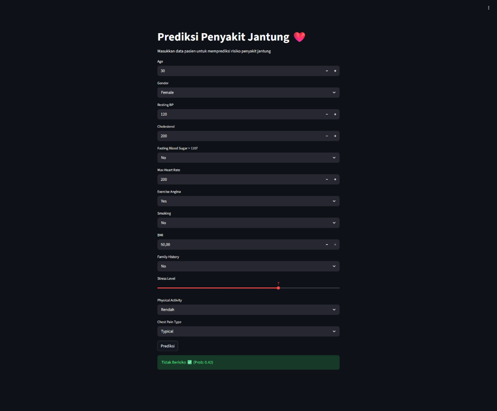
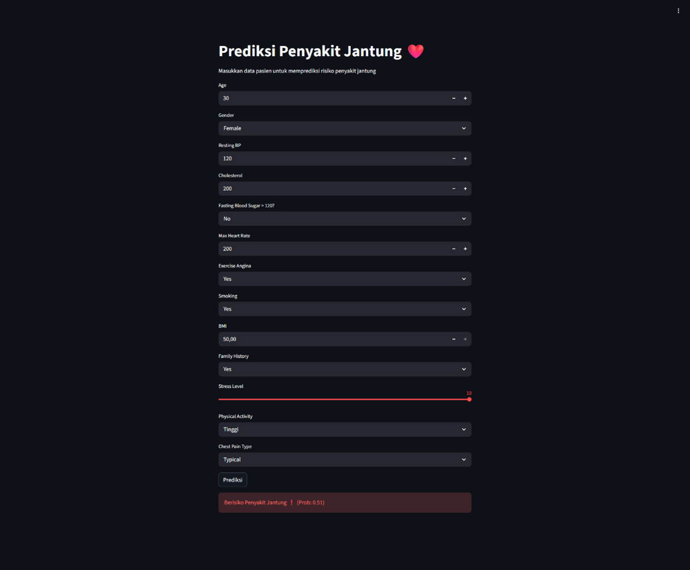

# ❤️ Heart Disease Prediction using Machine Learning

## 📌 Deskripsi Proyek

Membangun model **Machine Learning** dalam memprediksi risiko penyakit jantung (**Heart Disease Prediction**) berdasarkan karakteristik pasien.

Pada proyek ini dilakukan seluruh tahapan data mining mulai dari:

- Data Understanding
- Data Preprocessing
- Exploratory Data Analysis (EDA)
- Model Training
- Hyperparameter Tuning
- Cross Validation
- Model Evaluation
- Feature Importance Analysis
- Prediksi Data Baru
- Implementasi Web menggunakan Streamlit

# 📂 Struktur Project

```
HeartDisease/
│
├── app.py                      # Streamlit Web App
├── heartV3.csv                 # Dataset
├── model_rf.pkl                # Model Random Forest
├── scaler.pkl                  # StandardScaler
├── feature_names.pkl           # Nama fitur
├── DataMiningPra-Uas.ipynb     # Notebook utama
├── README.md
└── requirements.txt
```

---

# 📖 Dataset

Dataset yang digunakan merupakan dataset **Heart Disease** yang berisi informasi karakteristik pasien beserta label apakah pasien mengalami penyakit jantung atau tidak.

## Target

```
HeartDisease
```

- 0 = Tidak memiliki penyakit jantung
- 1 = Memiliki penyakit jantung

---

## Fitur Dataset

Beberapa fitur yang digunakan antara lain:

- Age
- Gender
- Resting Blood Pressure
- Cholesterol
- Fasting Blood Sugar
- Maximum Heart Rate
- Exercise Angina
- Smoking
- BMI
- Family History
- Stress Level
- Physical Activity
- Chest Pain Type

---

# ⚙️ Tahapan Data Mining

## 1. Data Understanding

Tahapan pertama adalah memahami isi dataset.

Beberapa proses yang dilakukan:

- Membaca dataset menggunakan Pandas
- Melihat lima data pertama
- Melihat informasi dataset (`info()`)
- Statistik deskriptif (`describe()`)
- Mengecek missing value khususnya pada kolom **Gender**

Tujuan tahap ini adalah mengetahui struktur dataset sebelum dilakukan pemrosesan lebih lanjut.

---

## 2. Data Preprocessing

Tahap preprocessing dilakukan agar data siap digunakan oleh algoritma Machine Learning.

Tahapan yang dilakukan meliputi:

### Encoding Data Kategorikal

Kolom kategorikal diubah menjadi numerik.

Contoh:

```
Male → 1
Female → 0

Yes → 1
No → 0
```

Kolom yang dilakukan encoding antara lain:

- Gender
- ExerciseAngina
- Smoking
- FamilyHistory

---

### One Hot Encoding

Kolom **Chest Pain Type** diubah menggunakan One-Hot Encoding sehingga menghasilkan fitur seperti:

- ChestPain_Typical
- ChestPain_Atypical
- ChestPain_Non-anginal

---

### Feature Scaling

Dilakukan menggunakan

```
StandardScaler
```

agar seluruh fitur memiliki skala yang seragam sehingga proses training model menjadi lebih optimal.

---

### Train Test Split

Dataset dibagi menjadi:

- Training Data
- Testing Data

dengan tujuan mengevaluasi performa model pada data yang belum pernah dilihat sebelumnya.

---

# 🤖 Modeling

Dua algoritma Machine Learning digunakan pada proyek ini.

## 1. Logistic Regression

Model pertama menggunakan Logistic Regression dengan parameter awal:

- solver = liblinear
- class_weight = balanced

Kemudian dilakukan **Grid Search** untuk mencari parameter terbaik.

Parameter yang diuji:

- C
- penalty

---

## 2. Random Forest

Model kedua menggunakan Random Forest.

Parameter yang diuji:

- n_estimators
- max_depth
- min_samples_split
- class_weight

Pemilihan parameter terbaik juga dilakukan menggunakan GridSearchCV.

---

# 🔍 Hyperparameter Tuning

Seluruh model dioptimasi menggunakan

```
GridSearchCV
```

dengan metode evaluasi

```
ROC-AUC Score
```

sehingga parameter terbaik dapat diperoleh secara otomatis.

---

# 🔁 Cross Validation

Model divalidasi menggunakan

```
10-Fold Stratified Cross Validation
```

Keuntungan metode ini:

- Mengurangi bias
- Menghasilkan evaluasi yang lebih stabil
- Memastikan distribusi kelas tetap seimbang pada setiap fold

---

# 📊 Exploratory Data Analysis (EDA)

Beberapa visualisasi yang dibuat meliputi:

### Distribusi Usia

Menampilkan hubungan antara usia pasien dengan penyakit jantung menggunakan histogram.

---

### Hubungan Cholesterol dan Resting Blood Pressure

Visualisasi scatter plot digunakan untuk melihat pola hubungan kedua variabel terhadap target penyakit jantung.

---

# 🏆 Pemilihan Model Terbaik

Setelah dilakukan proses tuning dan cross validation, dilakukan perbandingan nilai ROC-AUC.

Model dengan performa terbaik dipilih sebagai model akhir.

Pada proyek ini model terbaik kemudian digunakan untuk:

- Evaluasi
- Prediksi data baru
- Implementasi Web Streamlit

---

# 📈 Evaluasi Model

Evaluasi dilakukan menggunakan beberapa metrik:

- Accuracy
- Precision
- Recall
- F1-Score
- ROC-AUC Score

Selain itu juga divisualisasikan menggunakan:

- ROC Curve

Evaluasi dilakukan pada data testing agar dapat mengukur kemampuan generalisasi model.

---

# 📌 Interpretasi Model

## Logistic Regression

Dilakukan analisis menggunakan

```
Odds Ratio
```

untuk mengetahui pengaruh setiap fitur terhadap kemungkinan seseorang mengalami penyakit jantung.

Semakin besar nilai Odds Ratio, maka semakin besar kontribusi fitur tersebut terhadap prediksi penyakit jantung.

---

## Random Forest

Dilakukan analisis menggunakan

```
Feature Importance
```

untuk mengetahui fitur mana yang paling berpengaruh terhadap keputusan model.

Visualisasi ditampilkan dalam bentuk grafik batang.

---

# 🔮 Prediksi Kasus Baru

Model diuji menggunakan beberapa data pasien baru.

Input pasien meliputi:

- Umur
- Tekanan darah
- Kolesterol
- BMI
- Riwayat keluarga
- Aktivitas fisik
- Tingkat stres
- Jenis nyeri dada
- dan fitur lainnya

Output yang diberikan berupa:

- Berisiko Penyakit Jantung
- Tidak Berisiko Penyakit Jantung

beserta nilai probabilitas prediksi.

---

# 🌐 Implementasi Web

Model terbaik disimpan menggunakan:

```
pickle
```

kemudian diimplementasikan menjadi aplikasi web menggunakan

```
Streamlit
```

Fitur yang tersedia:

- Input seluruh data pasien
- Tombol prediksi
- Menampilkan probabilitas
- Menampilkan status risiko penyakit jantung

---

# 📸 Tampilan Aplikasi

## Hasil Prediksi Positive

```
images/positive.png
```



---

## Hasil Prediksi Negative

```
images/negative.png
```



---

# 🚀 Cara Menjalankan Project

## 1. Clone Repository

```bash
git clone https://github.com/username/HeartDiseasePrediction.git
```

---

## 2. Install Dependency

```bash
pip install -r requirements.txt
```

---

## 3. Jalankan Streamlit

```bash
streamlit run app.py
```

---

# 📦 Library yang Digunakan

- Pandas
- NumPy
- Matplotlib
- Seaborn
- Scikit-Learn
- Joblib
- Streamlit

---

# 🎯 Kesimpulan

Pada proyek ini telah berhasil dibangun sistem prediksi penyakit jantung menggunakan pendekatan Machine Learning melalui tahapan data mining yang lengkap, mulai dari pemahaman data, preprocessing, eksplorasi data, pelatihan model, optimasi hyperparameter, evaluasi, hingga implementasi aplikasi web.

Dua algoritma dibandingkan, yaitu **Logistic Regression** dan **Random Forest**, dengan proses **10-Fold Cross Validation** dan **GridSearchCV** untuk memperoleh model terbaik. Model akhir kemudian diimplementasikan ke dalam aplikasi **Streamlit** sehingga pengguna dapat melakukan prediksi risiko penyakit jantung secara interaktif berdasarkan data pasien yang dimasukkan.

---

# 👤 Author

**Nandika Aqsa Almuntaha**

Teknik Informatika

Universitas Sriwijaya